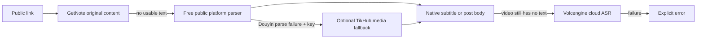

# Social Media Toolkit

<p align="center">
  <a href="README.md">English</a> |
  <a href="README.zh-CN.md">简体中文</a>
</p>

<p align="center">
  Turn public Douyin, Xiaohongshu (RedNote), Bilibili, and YouTube links into normalized metadata, text, timed transcripts, media manifests, and supported public-comment samples.
</p>

<p align="center">
  <a href="https://github.com/JNHFlow21/social-media-toolkit/actions/workflows/ci.yml"></a>
  <a href="https://github.com/JNHFlow21/social-media-toolkit/releases"></a>
  <a href="LICENSE"></a>
  
  
  
</p>


> **Maturity:** alpha. The normalized `PostBundle` contract is versioned, but public platform pages and endpoints can change without notice.

Social Media Toolkit is an open-source Python SDK, `socialkit` CLI, and Model Context Protocol (MCP) server for developers and AI agents that need one auditable interface for public social-media extraction. It does not require a browser profile, cookies, a logged-in session, Agent Switch, or the maintainer's machine.

## Quick start

### Install or update

Prerequisite: Node.js 18+ with `npm` / `npx`.

```bash
npx -y github:JNHFlow21/social-media-toolkit
socialkit doctor
```

The installer:

1. reuses `uv` when available or downloads it from the official Astral installer;
2. installs the Python package in an isolated `uv tool` environment;
3. exposes `socialkit` and `social-media-toolkit-mcp` on the user command path;
4. never reads provider credentials or creates a project `.env` file.

`socialkit doctor` returns JSON. A machine with only the free public-reading path configured can report `"status": "partial"`; use its `warnings` field to see which optional text or long-recording capabilities are unavailable.

```json
{
  "status": "partial",
  "supported_platforms": ["douyin", "xiaohongshu", "bilibili", "youtube"],
  "local_asr_fallback": false,
  "warnings": ["optional capability setup guidance"]
}
```

Run the same `npx` command to update. Uninstall with:

```bash
uv tool uninstall social-media-toolkit
```

<details>
<summary>Source checkout for contributors</summary>

```bash
git clone https://github.com/JNHFlow21/social-media-toolkit.git
cd social-media-toolkit
uv sync --locked
uv run socialkit doctor
```

</details>

## First useful result

Inspect a public share URL without downloading media or starting GetNote / ASR:

```bash
socialkit inspect "SHARE_URL"
```

The command returns a normalized, provenance-bearing bundle:

```json
{
  "schema_version": "1.0",
  "source": {"platform": "youtube", "url": "https://example.invalid/public-post"},
  "post": {"title": "Example public post"},
  "media": {"videos": [], "covers": [], "images": [], "audio": []},
  "content": {},
  "comments": {},
  "provenance": {"routes": ["platform:public"]}
}
```

The example is synthetic. Real fields depend on what the public source exposes.
If the free Douyin parser fails and `TIKHUB_API_KEY` is configured, `inspect`
automatically uses the paid TikHub fallback and records that route plus the
ephemeral-media warning in provenance.

## What it can do

| Outcome | Interface | Requirements | Possible cost |
|---|---|---|---:|
| Normalize public metadata | SDK / CLI / MCP | Python dependencies; YouTube uses `yt-dlp` | Free by default; optional TikHub Douyin fallback may cost money |
| Get readable text | GetNote → public parser / optional TikHub media → native subtitle/body → Volcengine ASR | Depends on the selected route | GetNote, TikHub, or Volcengine may cost money |
| Create timed YouTube transcripts | Manual cues → automatic cues → timed Volcengine ASR | `yt-dlp`; ASR also needs `ffmpeg` and credentials | ASR/TOS may cost money |
| Download video, cover, or images | Explicit `download` / `capture` request | An explicit output directory | Toolkit is free |
| Sample public comments | Douyin top-level public sample | No cookies or account | No |
| Use the same logic from an agent | Six MCP tools | MCP-compatible client | Depends on selected route |

### Platform matrix

| Platform | Metadata | Text | Video | Cover / images | Public comments |
|---|---:|---:|---:|---:|---:|
| Douyin | ✅; optional TikHub fallback | GetNote → public/TikHub media → Volcengine ASR | ✅ | ✅, including public image posts | ✅ bounded top-level sample |
| Xiaohongshu / RedNote | ✅ | GetNote → post body / Volcengine ASR | ✅ | ✅ | — |
| Bilibili | ✅ | GetNote → native subtitle → Volcengine ASR | ✅ | ✅ | — |
| YouTube | ✅ | GetNote → manual subtitle → automatic subtitle → Volcengine ASR | ✅ | ✅ | — |

Douyin comment sorting applies only to the public sample returned by the source. It is not a platform-wide ranking, and the toolkit does not paginate or backfill missing items.

## Text and transcript routes

The normal readable-text route has one deterministic order:



There is no local Whisper fallback, alternate ASR provider, OCR/Vision fallback, LLM rewriting, browser automation, CDP, Playwright, or cookie-backed extraction.

Timed YouTube mode is a separate evidence route because every segment must point back to the source video:

```text
manual subtitle cues → automatic subtitle cues → timed Volcengine ASR
```

It writes only the requested MD/SRT/JSON artifacts to an explicit output directory. Temporary media is deleted before the call returns. `--force-asr --speaker-info` can bypass existing captions and request anonymous speaker clusters such as `SPEAKER_01`; those labels do not identify real people.

### Duration-aware ASR

| Media duration | Route | Extra requirement |
|---|---|---|
| Up to 2 hours | Volcengine flash ASR | `VOLCENGINE_ASR_API_KEY` |
| Over 2 and up to 5 hours | Volcengine standard ASR | Two TOS secrets plus bucket/region/endpoint configuration |
| Over 5 hours | Rejected before media download | No automatic chunking |

The standard route uploads one temporary private TOS object, submits a presigned URL, and deletes the object on success or failure.

## Optional configuration

Public metadata, public media downloads, supported public comments, and native captions do not require a Volcengine key.

### GetNote

```bash
npm install -g @getnote/cli
getnote auth login
```

GetNote manages its own credentials. Its service may require a paid membership. Calling `text`, a text-enabled `capture`, or a full-chain smoke test is the execution signal for the documented route and can save the URL to the user's GetNote account.

### Optional TikHub fallback for Douyin

Secret name:

```text
TIKHUB_API_KEY
```

The toolkit always tries the free public Douyin adapter first. Only when that
adapter fails and this secret is configured does the single orchestrator call
TikHub's Web share-URL endpoint. TikHub supplies normalized public metadata and
temporary CDN media URLs; it is not a text or ASR provider. Requests may incur
TikHub charges, and returned CDN URLs can expire. The route, cost warning, and
ephemeral-URL status are preserved in every result.

Get a key and API documentation from [TikHub](https://docs.tikhub.io/257556744e0),
then inject it through the process environment, MCP client, or another secret
manager. Never write it to a project `.env` file.

### Volcengine ASR and TOS

Secret names:

```text
VOLCENGINE_ASR_API_KEY
TOS_ACCESS_KEY
TOS_SECRET_KEY
```

Non-sensitive long-recording settings:

```text
TOS_BUCKET
TOS_REGION
TOS_ENDPOINT
TOS_OBJECT_PREFIX            # optional
TOS_PRESIGN_EXPIRES          # optional
```

Inject secrets through the operating system, MCP client, or another secret manager. Do not commit them or write them to a project `.env` file. Non-sensitive TOS settings may instead live at `~/.config/social-media-toolkit/config.json`:

```json
{
  "volcengine_tos": {
    "bucket": "example-private-bucket",
    "region": "example-region",
    "endpoint": "https://example-tos-endpoint.invalid",
    "object_prefix": "social-media-toolkit/long-asr"
  }
}
```

The repository never stores secret values. Agent Switch is an optional maintainer integration, not a package dependency.

## CLI examples

```bash
# Metadata only: no persistent write, GetNote, or ASR
socialkit inspect "SHARE_URL"

# Readable canonical text; may use GetNote, paid TikHub media, or paid ASR
socialkit text "SHARE_URL"

# Timed YouTube transcript artifacts
socialkit text "YOUTUBE_URL" \
  --timed \
  --output "/absolute/path/to/transcripts" \
  --outputs md,srt,json

# Force timed ASR with anonymous speaker clusters
socialkit text "YOUTUBE_URL" \
  --timed --force-asr --speaker-info \
  --asr-context-file "/absolute/path/to/public-context.json" \
  --output "/absolute/path/to/transcripts" \
  --outputs json,md,srt

# Bounded Douyin public-comment sample
socialkit comments "DOUYIN_URL" --sort likes --limit 20

# Explicit persistent media download
socialkit download "SHARE_URL" \
  --include video,cover,images \
  --output "/absolute/path/to/output"
```

`--speaker-info` and `--asr-context-file` require `--force-asr`. Context is a bounded public-metadata vocabulary hint, not identity mapping.

## Python SDK

```python
from social_media_toolkit import SocialMediaToolkit

toolkit = SocialMediaToolkit()

bundle = toolkit.inspect("SHARE_URL")
text = toolkit.get_text("SHARE_URL")
timed = toolkit.get_text(
    "YOUTUBE_URL",
    timed=True,
    output_dir="/absolute/path/to/transcripts",
    outputs="md,srt,json",
)
comments = toolkit.get_comments("DOUYIN_URL", sort_by="likes", limit=20)
```

The SDK, CLI, and MCP server use the same `SocialMediaToolkit` orchestrator and the same versioned result contracts.

## MCP server

Start the stdio server:

```bash
social-media-toolkit-mcp
```

Client configuration:

```json
{
  "mcpServers": {
    "social-media-toolkit": {
      "command": "social-media-toolkit-mcp"
    }
  }
}
```

Do not place secrets in this JSON. Use the client's secret store or secure process environment.

| MCP tool | Purpose |
|---|---|
| `social_inspect` | Normalize public metadata without download or transcription |
| `social_get_text` | Run the readable or timed text contract |
| `social_get_comments` | Fetch the supported public-comment sample |
| `social_download` | Explicitly download requested media |
| `social_capture_bundle` | Combine normalized data and requested downloads |
| `social_doctor` | Report dependencies and configuration names without values |

## Trust and boundaries

| Area | Contract |
|---|---|
| Access | Public URLs only; no access-control bypass, browser login, or private analytics |
| Credentials | Standard environment or client secret store; values are never returned or logged |
| Persistent writes | Only explicit output directories and the optional user config file |
| Temporary data | ASR media and standard-route TOS objects are deleted before return |
| Telemetry | No product telemetry |
| Network | Public platform/GetNote reads and optional TikHub/Volcengine/TOS calls |
| Publishing | Uploading or publishing to social accounts is intentionally out of scope |
| Legal | Users remain responsible for platform terms, copyright, and local law |

The downloader accepts HTTP(S), rejects local/private literal IPs, bounds download size, sanitizes filenames, and records SHA-256 manifests. See [SECURITY.md](SECURITY.md) for private vulnerability reporting.

## Compatibility and distribution

- Python 3.10–3.12 are the supported package runtimes.
- Node.js 18+ is required only for the one-command bootstrap.
- macOS, Linux, and Windows are exercised by CI; platform endpoints themselves may still change independently.
- The canonical user distribution is the GitHub-backed `npx` installer and isolated `uv tool` environment.
- Versioned source distributions, wheels, npm tarballs, and checksums are attached to GitHub Releases.

## Architecture and documentation

- [Architecture and side effects](docs/architecture.md)
- [Capability matrix and limitations](docs/capabilities.md)
- [Release history](CHANGELOG.md)
- [Contributor guide](CONTRIBUTING.md)
- [Security policy](SECURITY.md)
- [Machine-readable project map](llms.txt)

## Development

```bash
uv sync --locked
uv run python -m unittest discover -s tests
uv run python -m compileall social_media_toolkit social_post_extractor_mcp
uv build
npm test
npm pack --dry-run
git diff --check
```

Tests use synthetic fixtures and must not contain real cookies, tokens, private media, or user content.

## Repository activity

[](https://github.com/JNHFlow21/social-media-toolkit)

## Contributing, support, and license

Bug reports and focused feature proposals are welcome through [GitHub Issues](https://github.com/JNHFlow21/social-media-toolkit/issues). Read [CONTRIBUTING.md](CONTRIBUTING.md) before opening a pull request, and use [GitHub's private vulnerability reporting](https://github.com/JNHFlow21/social-media-toolkit/security/advisories/new) for security issues.

Licensed under the [Apache License 2.0](LICENSE).
