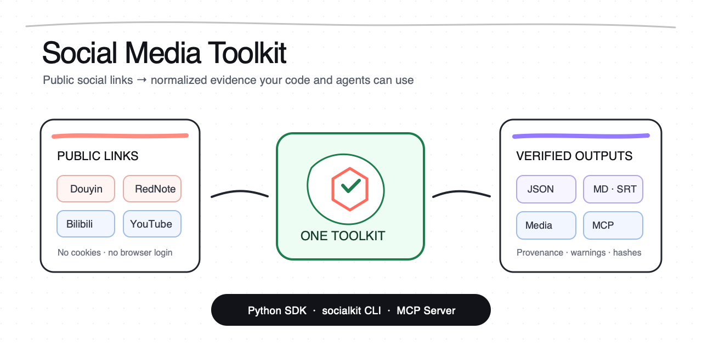

# Social Media Toolkit

<p align="center">
  <a href="README.md">English</a> |
  <a href="README.zh-CN.md">简体中文</a>
</p>

<p align="center">
  将抖音、小红书（RedNote）、Bilibili 和 YouTube 的公开链接，转换为统一的元数据、正文、带时间码的逐字稿、媒体清单，以及当前支持的公开评论样本。
</p>

<p align="center">
  <a href="https://github.com/JNHFlow21/social-media-toolkit/actions/workflows/ci.yml"></a>
  <a href="https://github.com/JNHFlow21/social-media-toolkit/releases"></a>
  <a href="LICENSE"></a>
  
  
  
</p>



> **成熟度：Alpha。** 统一的 `PostBundle` 数据契约已经版本化，但公开平台的页面和接口仍可能随时变化。

Social Media Toolkit 是面向开发者和 AI Agent 的开源 Python SDK、`socialkit` CLI 与 Model Context Protocol（MCP）服务器。它为公开社交媒体内容提取提供一套统一、可审计的接口，不需要浏览器配置文件、Cookie、登录状态或 Agent Switch，也不依赖维护者的电脑环境。

## 快速开始

### 安装或更新

前置条件：Node.js 18+，并带有 `npm` / `npx`。

```bash
npx -y github:JNHFlow21/social-media-toolkit
socialkit doctor
```

安装器会：

1. 优先使用本机已有的 `uv`；如果没有，则从 Astral 官方安装器下载；
2. 在隔离的 `uv tool` 环境中安装 Python 包；
3. 将 `socialkit` 和 `social-media-toolkit-mcp` 加入用户命令路径；
4. 不读取服务商凭据，也不会创建项目级 `.env` 文件。

`socialkit doctor` 返回 JSON。只配置了免费公开读取能力的机器，可能显示 `"status": "partial"`；请查看 `warnings`，了解尚未配置的可选文字提取或长音频转写能力。

```json
{
  "status": "partial",
  "supported_platforms": ["douyin", "xiaohongshu", "bilibili", "youtube"],
  "local_asr_fallback": false,
  "warnings": ["optional capability setup guidance"]
}
```

再次运行同一条 `npx` 命令即可更新。卸载命令：

```bash
uv tool uninstall social-media-toolkit
```

<details>
<summary>从源码安装（适合贡献者）</summary>

```bash
git clone https://github.com/JNHFlow21/social-media-toolkit.git
cd social-media-toolkit
uv sync --locked
uv run socialkit doctor
```

</details>

## 先跑通一次

检查一个公开分享链接，同时避免下载媒体或启动 GetNote / ASR：

```bash
socialkit inspect "SHARE_URL"
```

命令会返回统一格式、带来源记录的内容包：

```json
{
  "schema_version": "1.0",
  "source": {"platform": "youtube", "url": "https://example.invalid/public-post"},
  "post": {"title": "Example public post"},
  "media": {"videos": [], "covers": [], "images": [], "audio": []},
  "content": {},
  "comments": {},
  "provenance": {"routes": ["platform:public"]}
}
```

以上是合成示例。真实字段取决于公开来源实际提供的内容。

## 能做什么

| 目标 | 使用方式 | 需要什么 | 是否可能产生费用 |
|---|---|---|---:|
| 统一公开元数据 | SDK / CLI / MCP | Python 依赖；YouTube 使用 `yt-dlp` | 否 |
| 获取可读文字 | GetNote → 原生字幕/正文 → 火山引擎 ASR | 取决于实际采用的路线 | GetNote 会员或火山 ASR 可能收费 |
| 生成 YouTube 带时间码逐字稿 | 人工字幕 → 自动字幕 → 带时间码的火山引擎 ASR | `yt-dlp`；ASR 还需要 `ffmpeg` 和凭据 | ASR/TOS 可能收费 |
| 下载视频、封面或图片 | 显式调用 `download` / `capture` | 必须指定输出目录 | 工具本身免费 |
| 抽取公开评论样本 | 抖音公开一级评论样本 | 不需要账号或 Cookie | 否 |
| 供 AI Agent 调用同一套逻辑 | 六个 MCP 工具 | 支持 MCP 的客户端 | 取决于实际采用的路线 |

### 平台支持

| 平台 | 元数据 | 文字 | 视频 | 封面/图片 | 公开评论 |
|---|---:|---:|---:|---:|---:|
| 抖音 | ✅ | GetNote → 火山引擎 ASR | ✅ | ✅，包含公开图文内容 | ✅ 有上限的一级评论样本 |
| 小红书 / RedNote | ✅ | GetNote → 帖子正文 / 火山引擎 ASR | ✅ | ✅ | — |
| Bilibili | ✅ | GetNote → 原生字幕 → 火山引擎 ASR | ✅ | ✅ | — |
| YouTube | ✅ | GetNote → 人工字幕 → 自动字幕 → 火山引擎 ASR | ✅ | ✅ | — |

抖音评论排序只针对来源返回的公开样本，不代表全平台排名。本工具不会翻页抓取，也不会补抓缺失评论。

## 文字与逐字稿路线

普通可读文字使用固定的优先顺序：


本项目不会回退到本地 Whisper、其他 ASR 服务商、OCR/Vision、LLM 改写、浏览器自动化、CDP、Playwright 或依赖 Cookie 的抓取方式。

YouTube 带时间码模式采用独立的可追溯路线，因为每个片段都必须能对应回原视频：

```text
人工字幕时间点 → 自动字幕时间点 → 带时间码的火山引擎 ASR
```

它只会把用户指定的 MD/SRT/JSON 文件写入明确的输出目录。临时媒体会在调用返回前删除。使用 `--force-asr --speaker-info` 可以跳过已有字幕并请求匿名说话人分离，例如 `SPEAKER_01`；这些标签不能用于识别真实人物。

### 按时长选择 ASR 路线

| 媒体时长 | 路线 | 额外要求 |
|---|---|---|
| 不超过 2 小时 | 火山引擎极速版 ASR | `VOLCENGINE_ASR_API_KEY` |
| 超过 2 小时且不超过 5 小时 | 火山引擎标准版 ASR | 两项 TOS 密钥，以及 bucket/region/endpoint 配置 |
| 超过 5 小时 | 下载媒体前直接拒绝 | 暂不自动分片 |

标准版会上传一个临时的私有 TOS 对象，通过预签名 URL 提交任务，并在成功或失败后删除该对象。

## 可选配置

读取公开元数据、下载公开媒体、获取当前支持的公开评论和原生字幕，都不需要火山引擎密钥。

### GetNote

```bash
npm install -g @getnote/cli
getnote auth login
```

GetNote 自行管理凭据，其服务可能需要付费会员。调用 `text`、启用文字的 `capture`，或执行完整链路测试，即表示请求运行文档中的文字路线，也可能将链接保存到用户自己的 GetNote 账号。

### 火山引擎 ASR 与 TOS

密钥名称：

```text
VOLCENGINE_ASR_API_KEY
TOS_ACCESS_KEY
TOS_SECRET_KEY
```

长音频路线需要的非敏感配置：

```text
TOS_BUCKET
TOS_REGION
TOS_ENDPOINT
TOS_OBJECT_PREFIX            # 可选
TOS_PRESIGN_EXPIRES          # 可选
```

请通过操作系统、MCP 客户端或其他密钥管理器注入密钥。不要提交密钥，也不要把它们写入项目 `.env`。非敏感 TOS 配置可以放在 `~/.config/social-media-toolkit/config.json`：

```json
{
  "volcengine_tos": {
    "bucket": "example-private-bucket",
    "region": "example-region",
    "endpoint": "https://example-tos-endpoint.invalid",
    "object_prefix": "social-media-toolkit/long-asr"
  }
}
```

仓库不会存储任何密钥值。Agent Switch 只是维护者可选的集成方式，不是本项目的运行依赖。

## CLI 示例

```bash
# 仅获取元数据：不持久化写入，也不调用 GetNote 或 ASR
socialkit inspect "SHARE_URL"

# 获取规范化的可读文字；可能使用 GetNote 或付费 ASR
socialkit text "SHARE_URL"

# 生成 YouTube 带时间码的逐字稿
socialkit text "YOUTUBE_URL" \
  --timed \
  --output "/absolute/path/to/transcripts" \
  --outputs md,srt,json

# 强制使用带匿名说话人分离的 ASR
socialkit text "YOUTUBE_URL" \
  --timed --force-asr --speaker-info \
  --asr-context-file "/absolute/path/to/public-context.json" \
  --output "/absolute/path/to/transcripts" \
  --outputs json,md,srt

# 获取有上限的抖音公开评论样本
socialkit comments "DOUYIN_URL" --sort likes --limit 20

# 显式下载并持久保存媒体
socialkit download "SHARE_URL" \
  --include video,cover,images \
  --output "/absolute/path/to/output"
```

`--speaker-info` 和 `--asr-context-file` 必须与 `--force-asr` 一起使用。上下文文件只是一个大小受限的公开元数据词汇提示，不用于人物身份映射。

## Python SDK

```python
from social_media_toolkit import SocialMediaToolkit

toolkit = SocialMediaToolkit()

bundle = toolkit.inspect("SHARE_URL")
text = toolkit.get_text("SHARE_URL")
timed = toolkit.get_text(
    "YOUTUBE_URL",
    timed=True,
    output_dir="/absolute/path/to/transcripts",
    outputs="md,srt,json",
)
comments = toolkit.get_comments("DOUYIN_URL", sort_by="likes", limit=20)
```

SDK、CLI 和 MCP 服务器共用同一个 `SocialMediaToolkit` 调度器和同一套版本化结果契约。

## MCP 服务器

启动 stdio 服务器：

```bash
social-media-toolkit-mcp
```

客户端配置：

```json
{
  "mcpServers": {
    "social-media-toolkit": {
      "command": "social-media-toolkit-mcp"
    }
  }
}
```

不要把密钥写进这段 JSON。请使用客户端自己的密钥存储或安全的进程环境。

| MCP 工具 | 用途 |
|---|---|
| `social_inspect` | 统一公开元数据，不下载也不转写 |
| `social_get_text` | 执行普通可读文字或带时间码文字契约 |
| `social_get_comments` | 获取当前支持的公开评论样本 |
| `social_download` | 显式下载请求的媒体 |
| `social_capture_bundle` | 合并统一数据与用户请求的下载内容 |
| `social_doctor` | 报告依赖和配置名称，不返回配置值 |

## 信任与边界

| 范围 | 约定 |
|---|---|
| 访问范围 | 只处理公开 URL；不绕过访问控制，不使用浏览器登录或私有分析数据 |
| 凭据 | 只从标准环境或客户端密钥存储读取；绝不返回或记录密钥值 |
| 持久写入 | 仅写入显式指定的输出目录和可选的用户配置文件 |
| 临时数据 | ASR 媒体和标准版 TOS 对象会在返回前删除 |
| 遥测 | 不采集产品遥测 |
| 网络访问 | 公开平台/GetNote 读取，以及可选的火山引擎/TOS 调用 |
| 发布能力 | 有意不提供向社交账号上传或发布内容的功能 |
| 法律责任 | 用户仍须遵守平台条款、版权要求和所在地法律 |

下载器只接受 HTTP(S)，拒绝字面值为本机或私有网段的 IP 地址，限制下载大小，清理文件名，并生成 SHA-256 清单。安全问题请参阅 [SECURITY.md](SECURITY.md)，并使用私密漏洞报告渠道。

## 兼容性与发行

- 支持 Python 3.10–3.12。
- Node.js 18+ 只用于一行安装器。
- CI 覆盖 macOS、Linux 和 Windows；平台端接口仍可能独立变化。
- 面向普通用户的标准安装方式，是基于 GitHub 的 `npx` 安装器与隔离的 `uv tool` 环境。
- GitHub Releases 提供带版本号的源码包、wheel、npm tarball 和校验文件。

## 架构与文档

- [架构与副作用说明](docs/architecture.md)
- [能力矩阵与限制](docs/capabilities.md)
- [版本记录](CHANGELOG.md)
- [贡献指南](CONTRIBUTING.md)
- [安全策略](SECURITY.md)
- [机器可读的项目地图](llms.txt)

## 开发

```bash
uv sync --locked
uv run python -m unittest discover -s tests
uv run python -m compileall social_media_toolkit social_post_extractor_mcp
uv build
npm test
npm pack --dry-run
git diff --check
```

测试只能使用合成 fixture，不得包含真实 Cookie、Token、私有媒体或用户内容。

## 仓库动态

[](https://github.com/JNHFlow21/social-media-toolkit)

## 贡献、支持与许可证

欢迎通过 [GitHub Issues](https://github.com/JNHFlow21/social-media-toolkit/issues) 报告 Bug 或提出范围明确的功能建议。提交 Pull Request 前请阅读 [CONTRIBUTING.md](CONTRIBUTING.md)；发现安全问题时，请使用 [GitHub 私密漏洞报告](https://github.com/JNHFlow21/social-media-toolkit/security/advisories/new)。

本项目采用 [Apache License 2.0](LICENSE)。
