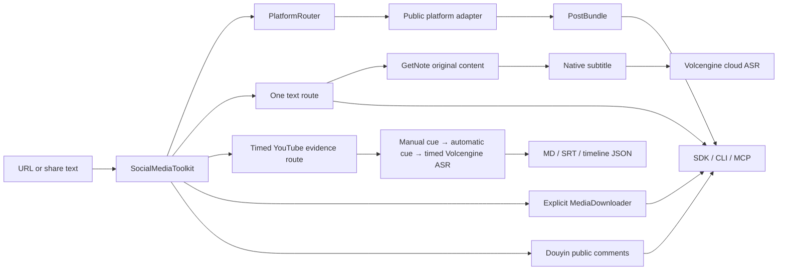

# Architecture

## One orchestrator

`SocialMediaToolkit` is the only workflow orchestrator used by the Python SDK,
CLI, and MCP transport.

## Packages

### `social_media_toolkit`

- `service.py`: the only orchestration policy.
- `models.py`: stable `PostBundle` and text-result contracts.
- `platforms/core.py`: public models, Douyin/Xiaohongshu/Bilibili adapters, and router.
- `platforms/youtube.py`: YouTube metadata and native subtitles through `yt-dlp`.
- `providers/getnote.py`: GetNote original-content reader.
- `providers/volcengine.py`: the only cloud ASR implementation.
- `transcripts.py`: timestamp normalization plus atomic MD/SRT/JSON rendering.
- `downloader.py`: explicit downloads and SHA-256 manifests.
- `cli.py`: JSON CLI.

### `social_post_extractor_mcp`

A thin stdio MCP transport. It owns no alternate extraction logic and creates
exactly one `SocialMediaToolkit` instance.

## Text contract

1. Ask GetNote for original content.
2. If unavailable, parse the platform.
3. Use native Bilibili/YouTube subtitles when present.
4. For a video still without text, call Volcengine big-model flash ASR.
5. If Volcengine fails, return the reason and stop.

There is no provider selector, local ASR, image OCR, LLM cleanup, or silent
fallback.

## Timed YouTube transcript contract

Timed mode is opt-in on the same `get_text` interface and requires an explicit
output directory. It is an evidence route rather than a canonical-reading
route:

1. Parse one YouTube video with `noplaylist` enabled.
2. Prefer manual subtitle cues in the source language.
3. Otherwise use automatic subtitle cues in the source language.
4. If no timed subtitle exists, temporarily prepare audio and call Volcengine.
5. Preserve sanitized utterance/word intervals and write requested MD/SRT/JSON.
6. Delete temporary media before returning.

GetNote is intentionally skipped because its plain canonical text does not
guarantee source-video timecodes. Default, non-timed `get_text` remains fully
backward compatible.

## Side effects

- `inspect`: public network reads only.
- `get_text`: by default runs configured GetNote, then native subtitles, then possibly paid Volcengine ASR; timed mode instead writes explicitly requested transcript artifacts and never persists media.
- `get_comments`: public network reads only.
- `download`: persistent writes and always requires `output_dir`.
- `capture`: media writes only when `output_dir` is supplied.

ASR media and extracted MP3 files live only inside a temporary directory and
are deleted when the call ends.

Calling `get_text`, a text-enabled `capture`, or a full-chain smoke test is the
execution signal for this documented route. Use `inspect` when metadata-only,
side-effect-free behavior is required.

## Security

- Runtime secret name: `VOLCENGINE_ASR_API_KEY` only.
- Secret values never appear in results or logs.
- The project does not load repository `.env` files.
- Standard process environment is the portable public configuration path.
- Agent Switch is an optional maintainer-only fallback, used through an
  inherited file descriptor when its executable happens to be available; it is
  not imported, packaged, or required.
- Downloader accepts HTTP(S), rejects local/private literal IPs, limits bytes,
  sanitizes filenames, and records SHA-256.
- Tests use synthetic fixtures.
