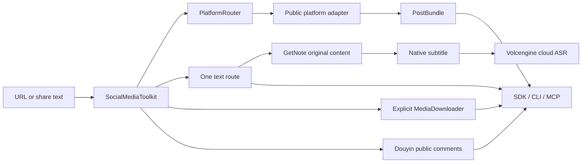

# Architecture

## One orchestrator

`SocialMediaToolkit` is the only workflow orchestrator used by the Python SDK,
CLI, and MCP transport.

## Packages

### `social_media_toolkit`

- `service.py`: the only orchestration policy.
- `models.py`: stable `PostBundle` and text-result contracts.
- `platforms/core.py`: public models, Douyin/Xiaohongshu/Bilibili adapters, and router.
- `platforms/youtube.py`: YouTube metadata and native subtitles through `yt-dlp`.
- `providers/getnote.py`: GetNote original-content reader.
- `providers/volcengine.py`: the only cloud ASR implementation.
- `downloader.py`: explicit downloads and SHA-256 manifests.
- `cli.py`: JSON CLI.

### `social_post_extractor_mcp`

A thin stdio MCP transport. It owns no alternate extraction logic and creates
exactly one `SocialMediaToolkit` instance.

## Text contract

1. Ask GetNote for original content.
2. If unavailable, parse the platform.
3. Use native Bilibili/YouTube subtitles when present.
4. For a video still without text, call Volcengine big-model flash ASR.
5. If Volcengine fails, return the reason and stop.

There is no provider selector, local ASR, image OCR, LLM cleanup, or silent
fallback.

## Side effects

- `inspect`: public network reads only.
- `get_text`: automatically runs configured GetNote, then native subtitles, then possibly paid Volcengine ASR; no persistent media and no second authorization prompt.
- `get_comments`: public network reads only.
- `download`: persistent writes and always requires `output_dir`.
- `capture`: media writes only when `output_dir` is supplied.

ASR media and extracted MP3 files live only inside a temporary directory and
are deleted when the call ends.

Calling `get_text`, a text-enabled `capture`, or a full-chain smoke test is the
execution signal for this documented route. Use `inspect` when metadata-only,
side-effect-free behavior is required.

## Security

- Runtime secret name: `VOLCENGINE_ASR_API_KEY` only.
- Secret values never appear in results or logs.
- The project does not load repository `.env` files.
- Agent Switch is used through an inherited file descriptor when available.
- Downloader accepts HTTP(S), rejects local/private literal IPs, limits bytes,
  sanitizes filenames, and records SHA-256.
- Tests use synthetic fixtures.
