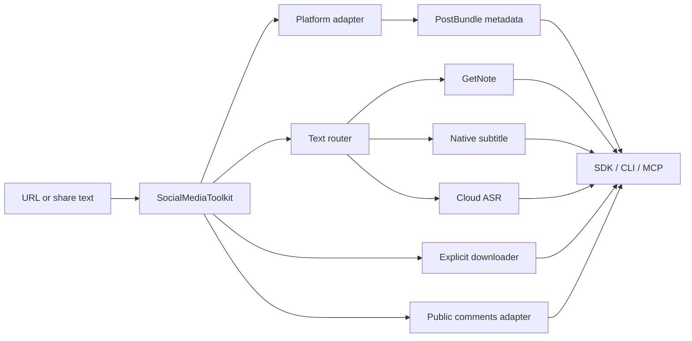

# Architecture

## Goal

Provide one reusable, read-first social-media toolkit without coupling the core to a specific AI client, knowledge base, or browser session.

## Packages

### `social_media_toolkit`

The public API.

- `service.py`: orchestration and deterministic fallback policy.
- `models.py`: versioned `PostBundle` and text result contracts.
- `platforms/`: platform adapters, including YouTube.
- `providers/`: optional providers such as GetNote.
- `downloader.py`: explicit media downloads and checksum manifests.
- `cli.py`: JSON CLI.

### `social_post_extractor_mcp`

The existing implementation and compatibility layer.

- Mature Douyin, Xiaohongshu, and Bilibili adapters.
- Cloud ASR, image OCR/vision, and legacy artifact generation.
- MCP server exporting both the new public tools and old tool aliases.

The public service currently reuses these mature adapters. Future refactors should move adapters inward without breaking MCP aliases or the `PostBundle` schema.

`source.platform_data` preserves adapter-specific public fields. `post.published_at`
is UTC ISO-8601, while `post.published_at_epoch` keeps the source epoch for
lossless interoperability.

## Text routing

The order is a product contract, not a heuristic:

1. Call GetNote when enabled.
2. Treat non-empty `data.note.web_page.content` as success, even if task metadata has a stale error.
3. If GetNote is unavailable or fails, inspect the platform.
4. Use YouTube or Bilibili native subtitles when present.
5. For a video with no native subtitle, use the explicitly configured cloud ASR provider.
6. Return provider, route, model, and warnings.

No local ASR is silently selected.

## Side-effect boundary

- `inspect`: network reads only.
- `get_text`: network reads and possibly paid cloud ASR; no persistent media output.
- `get_comments`: public network reads only.
- `download`: persistent file writes, always requires `output_dir`.
- `capture`: enrichment is opt-in; media writes occur only when `output_dir` is supplied.

Publishing is intentionally absent because it mutates external accounts.

## Security boundary

- Secrets are received only through the process environment/provider tooling.
- Results never include secret values.
- Downloader accepts HTTP(S), rejects localhost/private IP literals, sanitizes filenames, limits bytes, and records SHA-256.
- Tests use synthetic fixtures.
